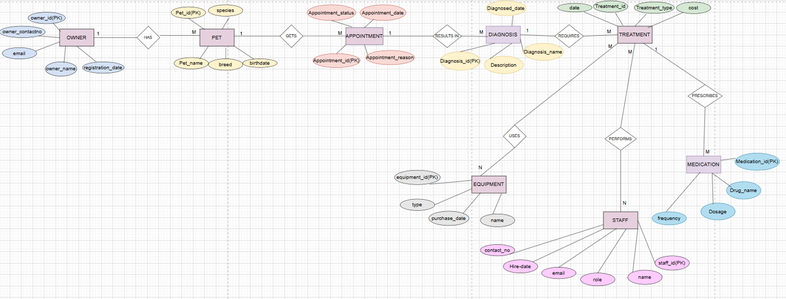
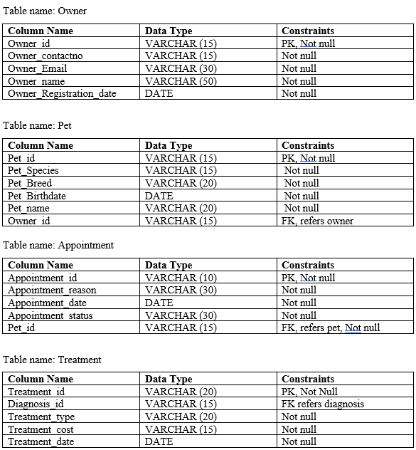
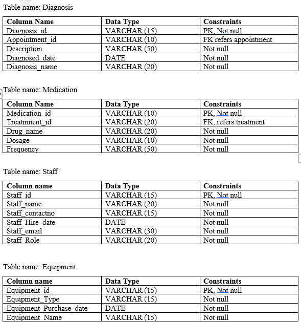
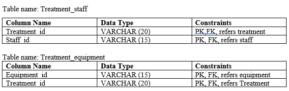
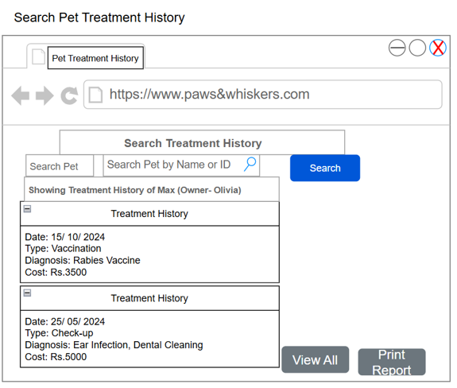
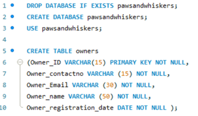
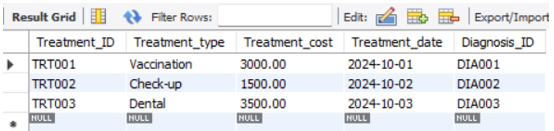

# Paws & Whiskers Animal Care — Relational Database System

A fully functional relational database system designed and built for a veterinary clinic to replace paper-based records with a structured digital system.

## Project Overview
Designed and implemented a complete database system for Paws & Whiskers Animal Care, a veterinary clinic in York, England. The system manages pet owners, pets, appointments, treatments, diagnoses, medications, staff, and equipment.

## Database Structure
10 interrelated tables fully normalized to Third Normal Form (3NF):
- Owners, Pets, Appointments, Diagnosis, Treatment
- Medication, Staff, Equipment
- Treatment_Staff (junction table), Treatment_Equipment (junction table)

## What Was Built
- Entity Relationship Diagram (ERD) with 5+ entities and defined cardinalities
- Logical relational schema with primary and foreign keys
- Full SQL DDL (CREATE TABLE) statements with constraints
- Sample data insertion across all tables
- 7 SQL queries: SELECT/WHERE, UPDATE, BETWEEN, IN, GROUP BY, ORDER BY, HAVING
- Referential integrity enforcement tested and verified
- Role-Based Access Control (RBAC) security design
- Test plan with 5 test cases (all passed)
- Wireframe interface designs for 3 screens
- User and developer feedback collection

## Tools Used
-MySQL 
-MySQL Workbench
-SQL

## Files
- paws_and_whiskers_database.sql` — Full SQL script (database creation, tables, data, queries)

## Key Concepts Demonstrated
- Database normalization (1NF, 2NF, 3NF)
- Referential integrity with foreign key constraints
- Many-to-many relationships via junction tables
- SQL querying and data manipulation
- Database security and access control design

## Screenshots

### ER Diagram

### Logical Schema - Part 1

### Logical Schema - Part 2

### Logical Schema - Part 3

### Interface Wireframe

### SQL Database Setup

### SQL Query Result

